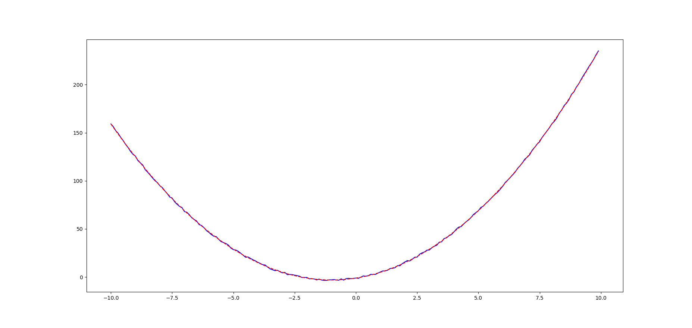
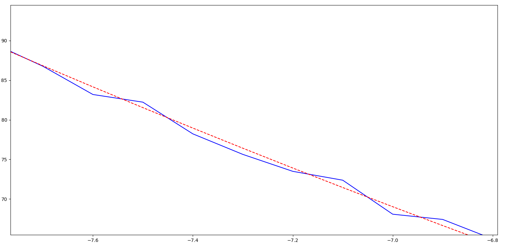
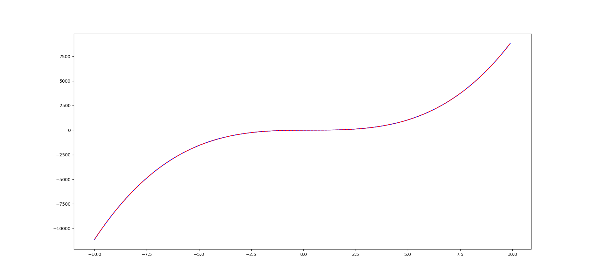
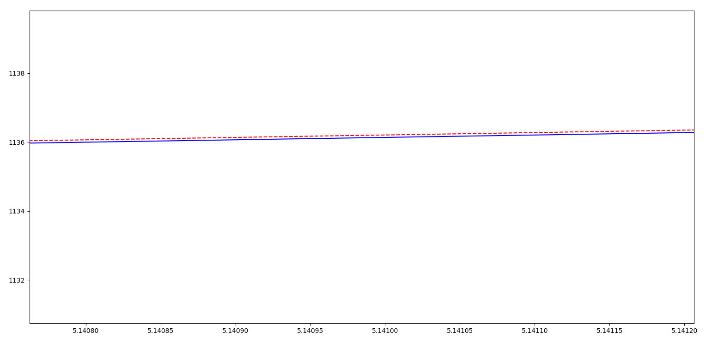

# EE298z - HW1
HW 1 of EE 298z: "Deep Learning"

#Description
Implement Gradient Descent Operation for Linear Regression of Arbitrary Polynomial Function. Tolerance is 0.1 and  Learning Rate is 0.0001 initially. If your error rate was reduced since the last iteration, you can try increasing the learning rate by 5%. If your error rate was actually increased (meaning that you skipped the optimal point) decrease the learning rate by 50%

**Given**
1. Add Uniform Distribution Noise from -1.0 to 1.0 to Output
2. Up to third degree polynomial

**References**
Motiviation for adaptive Learning inspired by **Bold Technique**
1. http://blog.datumbox.com/tuning-the-learning-rate-in-gradient-descent/
2. http://www.willamette.edu/~gorr/classes/cs449/momrate.html

If your error rate was reduced since the last iteration, you can try increasing the learning rate by 5%.
If your error rate was actually increased (meaning that you skipped the optimal point) decrease the learning rate by 50%

# Screenshots/Examples
Tolerance is 0.1 and Initial Learning Rate is 0.0001 . The  input points are from (-10,10) with 0.1 interval.  graphs that are blue and solid are made by the input, given weights of user and adding Uniform Noise to the output. The graphs that are red and dashed/have broken lines are made by the input, weights given by Gradient Descent Operation.

| Input Polynomial Weights     | Number of iterations           | Weights given after GDO  |  Learning Rate given after GDO  |
| -----------------------------|:------------------------------:|------------------------:| --------------------------------:|
| 2 4 -1      |  14011 | 2.0004277 4.00215834 -1.04156681 | 0.00000306911418331608 |
| 10 -10 10 -10    | 1813395  | 9.999494 -10.00024242 10.03449782 -9.95054273 | 0.00000009929490366652 |

**Given 2 4 -1**

With 2 4 -1 as weights:

**Up close screenshot**

**Given 10 -10 10 -10**

**Upclose screenshot**

